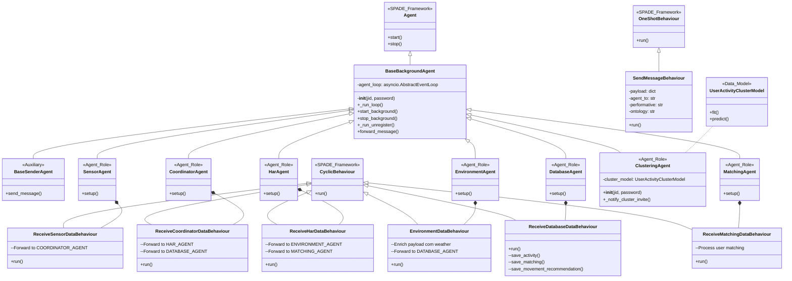

# Diagrama de Classes - Dance4Life Agent Architecture

## Código Mermaid



## Fluxo de Dados

```
SensorAgent 
    ↓ (forward_message)
CoordinatorAgent 
    ↓↓
HarAgent ← EnvironmentAgent
    ↓↓
MatchingAgent → ClusteringAgent
    ↓
DatabaseAgent (Firebase)
```

## Descrição dos Componentes

### Agentes Principais

| Agente | Responsabilidade |
|--------|-----------------|
| **SensorAgent** | Ponto de entrada para dados de sensores externos |
| **CoordinatorAgent** | Orquestra o fluxo de mensagens entre agentes |
| **HarAgent** | Processa Human Activity Recognition (HAR) |
| **EnvironmentAgent** | Enriquece dados com informações ambientais (weather) |
| **DatabaseAgent** | Persiste dados em Firebase |
| **MatchingAgent** | Processa matching entre usuários |
| **ClusteringAgent** | Realiza clustering de atividades de usuários |

### Comportamentos

- **ReceiveSensorDataBehaviour**: Recebe e processa dados de sensores
- **ReceiveCoordinatorDataBehaviour**: Coordena fluxo de mensagens
- **ReceiveHarDataBehaviour**: Processa HAR e encaminha para múltiplos agentes
- **EnvironmentDataBehaviour**: Enriquece payload com dados ambientais
- **ReceiveDatabaseDataBehaviour**: Salva dados em Firebase
- **ReceiveMatchingDataBehaviour**: Processa matching de usuários

### Base Classes

- **BaseBackgroundAgent**: Gerencia execução assíncrona em thread separada
- **BaseSenderAgent**: Auxiliar para envio de mensagens

### Modelos de Dados

- **UserActivityClusterModel**: Modelo de clustering de atividades de usuários
